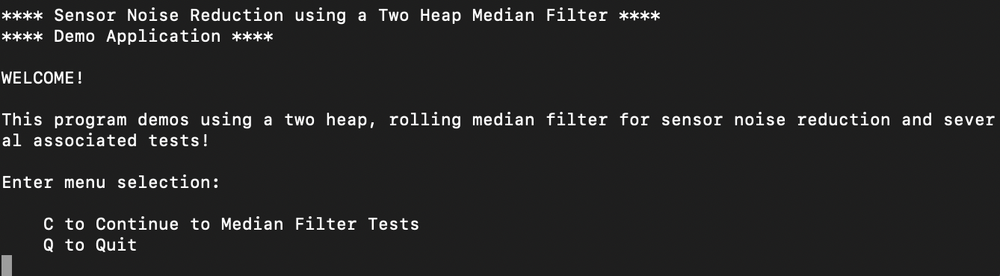
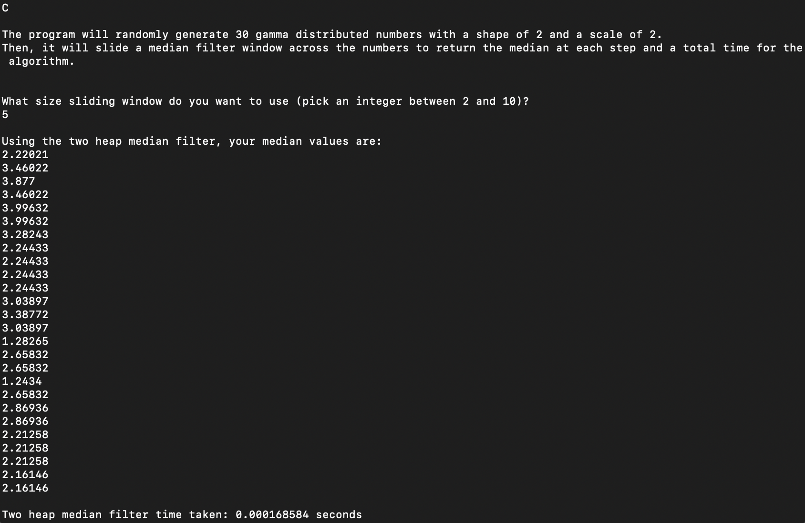
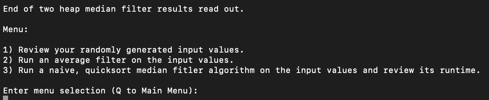

# Rolling Median Filter for Sensor Noise Reduction

## Introduction:
Sensor noise is a common occurrence and can be a hindrance to robotics perception. Improving
sensor input data quality by removing random fluctuations that degrade clarity, accuracy, and detail
thus improves quality of inference by ML models and ultimately robotics decision making. In robotics,
this helps smooth noisy distance sensors, gyroscope readings, or visual depth data.  
  
This project’s objective is to implement a real-time median filter that uses two heaps (a min-heap and
a max-heap) to efficiently maintain a rolling median over a fixed-size sliding window of sensor data.
Real-time applications require efficiency which is why this algorithm uses the heap-based approach
rather than sorting at every step.

## Background:
Personal motivations for this project include an interest in robotics and a desire to move deeper into
algorithmic optimizations. Median filters are foundational in robotics, offering exposure to real-time
data handling, heap-based algorithms, and statistical estimations.  
  
On the technical front, noisy sensors are inevitable; all sensors produce noise. Traditional filters, like moving average filters, can smooth noise but distort sudden changes. Averages are sensitive to
outliers where a single very high or low reading pulls the average toward it. On the other hand,
median filtering preserves edge information and sudden jumps better. The median ignores the
magnitude of the extremes. For production applications, computing medians quickly enough for
streaming data is tricky, which is why this algorithm relies on the two-heap method to efficiently make
the calculation.
  
This project implements both a two heap and a quicksort approach for the medial filter. The two heap median filter has an overall O(n * log(k)) while the quicksort median filter has an overall O(n * k * log(k)); where n is the input size and k is the window size of the filter.

## Features:
The demo app runs though the CLI. The user is can run the two heap median filter and choose a window size for their algorithm:

The medians and the runtime of the algorithm are printed:

The user can then review the input values for the algorithm, test an average filter on them or test a naive, quicksort filter on them:

  
## Data Structure Explanation:
In the two heap filter, a max-heap is used to track the lower half of the readings, while a min-heap is used to track the
upper half of the readings. This facilitates constant-time access to the median elements. O(log n) time for insertion and deletion with lazy deletion, facilitates an effectient rebalancing of the two heaps. Note: If the window size is even, the algorithm averages the two middle values to retrieve the median.

## File Structure:
* analysis: includes simulation results (in data) for the two heap and the quicksort methods as well as a Jupyter Notebook discussing the results. 
* images: screenshots of the app
* src: Contains the app/main.cpp, the code for the two heap and quicksort implementations, and a scripts folder for running simulations. 

## Installation and Usage:
Copy the code locally. From the command line and the app folder, run "g++ main.cpp -o main && ./main" to run the demo app. From the command line and the scripts folder run "g++ simulations.cpp -o simulations && ./simulations" to run a simulation of both the two heap and the quicksport methods at the same time. You'll want to edit either the window_size or input_size variables manually to change the simulation. Note: a Gamma distribution is used to simulate the numbers so that the underlying data has spikes, similar to real world sensor noise. Look for "edit me" comments in the code to find the viariables to edit. 

## Demo and Simulations Results:

* Demo: https://drive.google.com/file/d/1DqrOjUXbJrNybPZCsKVuuWma2KZCpptl/view?usp=sharing
* Results: 

## Conclusions:

The Results Jupyter Notebook has the details on the simulations. In conclusion, the two heap median filter is more effecient with larger window sizes compared to the naive, quicksort method. 
  
The key takeway from this project is as follows: Before configuring this algorithm to work in a production system, it's important to understand the underlying distribution of a sensor data. The engineer should first capture a sample data set, plot it and study it to ensure that the deployment of the median filter will work as intended. Sensor noise shows up differently depending on the data. 
  
## Future Opportunities:
It's my intent to configure the two heap filter with a sensor (the type of filter is still TBD) and an Arduino board to visualize the effects in real-time. I will be completing and posting this work in mid-December 2025.

## References:
* https://algo.monster/liteproblems/480
* https://thewayofnada.medium.com/a-very-thorough-solution-to-sliding-window-median-and-some-heap-magics-5091a3ed1cdc
* https://docs.wpilib.org/en/stable/docs/software/advanced-controls/filters/median-filter.html
* https://stackoverflow.com/questions/79639056/how-can-i-efficiently-maintain-median-in-a-dynamic-data-stream-with-support-for?utm_source=chatgpt.com
* https://www.edn.com/median-filters-an-efficient-way-to-remove-impulse-noise/?utm_source=chatgpt.com